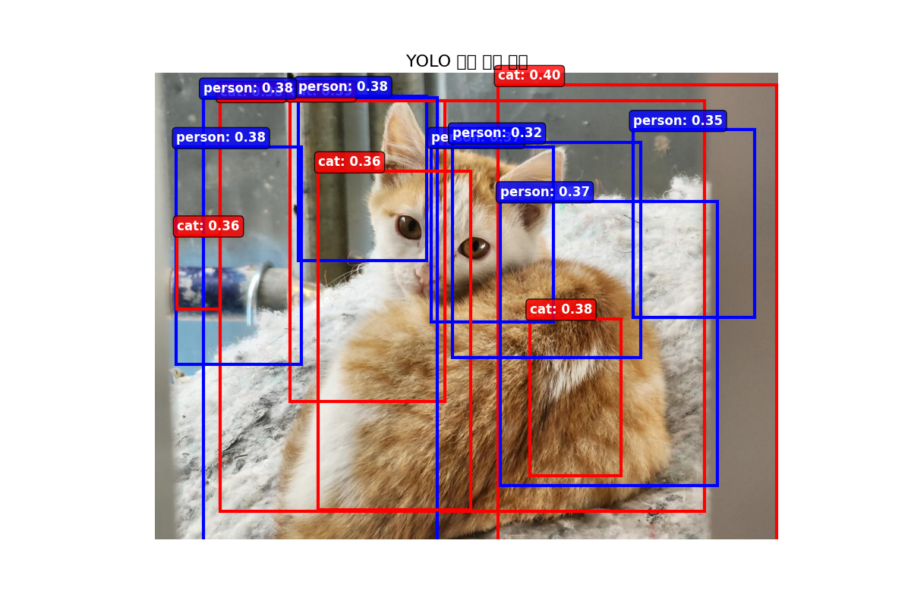
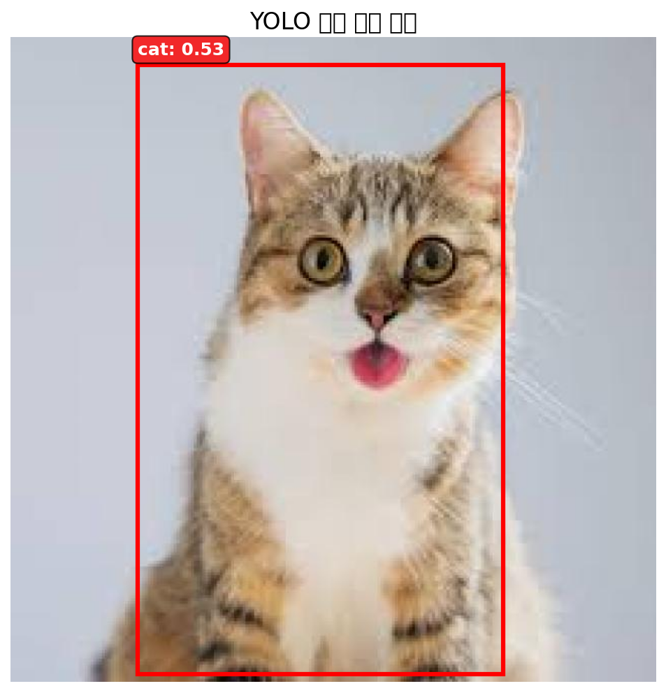
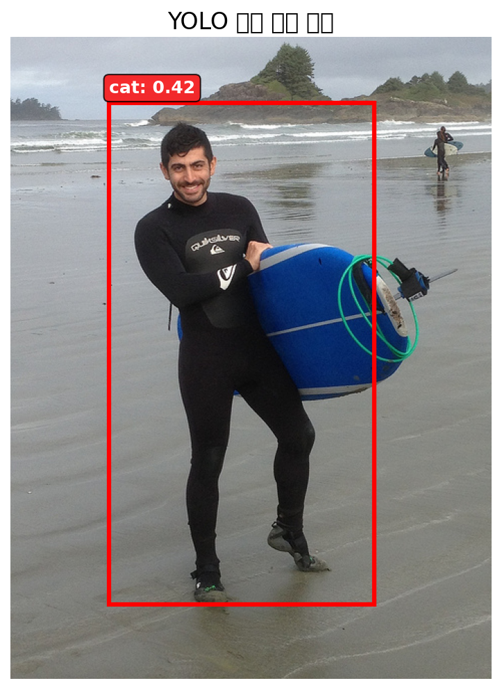

욜로 모델을 간단히 카피

원본 이미지를 7×7 = 49개 셀로 나눔

<table>
  <tr>
    <td align="center"><b>첫 번째 모델 테스트 결과</b></td>
  </tr>
  <tr>
    <td></td>
  </tr>
  </table>

### 문제점
 중복 검출
 너무 낮은 신뢰도 표시
 사람이 없는데도 person으로 잘못된 분류(파란박스)

### 개선 방법
 더 많은 데이터 학습: 현재 사람과 고양이 이미지 20장만 가지고 30에포크 만큼 학습</br>
 NMS 임계값 조정</br>
 신뢰도 임계값 조정</br>

---

## 2번째 버전 
 고양이 이미지 2000천 장, 사람 이미지 400백 장으로 학습 총 소요시간 3시간50분
 
 ```
# 훈련 하이퍼파라미터
TRAIN_CONFIG = {
    'epochs': 300, #에포크 300
    'batch_size': 16, # 배치사이즈
    'learning_rate': 0.001,
    'weight_decay': 1e-4,
    'lambda_coord': 5.0,
    'lambda_noobj': 0.5,
    'train_val_split': 0.8
}
```

  - 훈련 손실: 0.7631
  - 검증 손실: 1.8548

 검증 손실이 훈련 손실보다 높게 나옴 -> 과적합 문제

<table>
  <tr>
    <td align="center"><b>두 번째 모델 테스트 결과 1</b></td>
    <td align="center"><b>두 번째 모델 테스트 결과 2</b></td>
  </tr>
  <tr>
    <td></td>
    <td></td>
  </tr>
  </table>

고양이에 대해서 첫 번째 버전과 약 36% 성능 향상

#### 문제점

 사람을 고양이라고 착각

### 개선 방법

 더 만은 사람 이미지로 학습(사람 이미지를 넣지 않고 훈련 시킨 실수가 있었음)</br>
 과적합 방지 300 -> 150</br>

---

## 3번째 모델
 고양이 이미지 2000천장 사람 이미지 4000장 총 소요시간 4시간 34분
 
```
TRAIN_CONFIG = {
    'epochs': 150,
    'batch_size': 16,
    'learning_rate': 0.001,
    'weight_decay': 5e-4,
    'lambda_coord': 5.0,
    'lambda_noobj': 0.5,
    'train_val_split': 0.85,    # 데이터 많으니 검증 비율 줄임
}
```

   - 훈련 손실: 3.5919
   - 검증 손실: 3.6397

2번째 모델에 비해 더 많은 이미지를 학습했음에도 학습률이 더 낮아짐과 과적합이 심하지는 않지만 손실이 커짐</b>
신뢰도가 0.53에서 0.36으로 -17% 정도 감소

#### 문제점

 과도한 정규화 -> 5e-4</b>
 클래스 불균형</b>

### 개선 방법

 고양이와 사람 이미지의 비율 조절 1대1이 되도록</b>
 5e-4와 이전 1e-4의 중간 2e-4값으로 정규화 완화 재학습</b>
 손실 함수 균형 조정</b>
 
